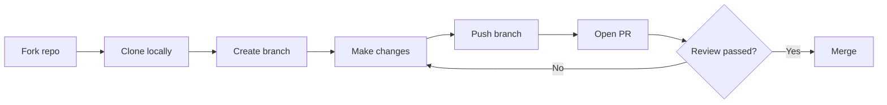
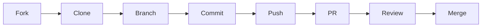
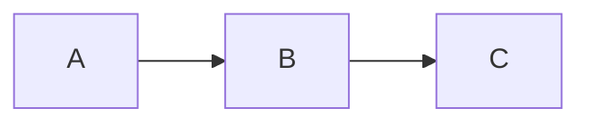

# Appendix E: GitHub Flavored Markdown — Advanced Reference
## Beyond the Basics: Tables, Alerts, Diagrams, Math, and Accessibility

> **Who this is for:** You know how to write basic Markdown (bold, italic, links, code blocks). This appendix covers the GitHub-specific extensions and features you will encounter in real repositories — the things that make a file look polished but that aren't documented in standard Markdown guides.

---

## Quick Navigation

1. [Alert / Callout Blocks (2023+)](#1-alert--callout-blocks-2023)
2. [Collapsible Sections with `<details>`](#2-collapsible-sections-with-details)
3. [Task List Checkboxes](#3-task-list-checkboxes)
4. [Mermaid Diagrams](#4-mermaid-diagrams)
5. [Math Expressions — LaTeX](#5-math-expressions--latex)
6. [Footnotes](#6-footnotes)
7. [Linked Heading Anchors](#7-linked-heading-anchors)
8. [Syntax Highlighting in Code Blocks](#8-syntax-highlighting-in-code-blocks)
9. [HTML in Markdown](#9-html-in-markdown)
10. [Screen Reader Considerations](#10-screen-reader-considerations)
11. [GFM Quick-Reference Card](#11-gfm-quick-reference-card)

---

## 1. Alert / Callout Blocks (2023+)

GitHub introduced **alert blocks** in 2023. They render as colored, bordered callout boxes — great for emphasizing warnings, tips, or critical information.

### Syntax

```markdown
> [!NOTE]
> Useful information that users should know, even when skimming.

> [!TIP]
> Helpful advice for doing something better or more easily.

> [!IMPORTANT]
> Key information users need to know to achieve their goal.

> [!WARNING]
> Urgent info that needs immediate attention to avoid problems.

> [!CAUTION]
> Advises about risks or negative outcomes of certain actions.
```

### How They Render

| Type | Color | Icon | Use When... |
|------|-------|------|-------------|
| `NOTE` | Blue | | Supplementary information |
| `TIP` | Green | | Best practice suggestions |
| `IMPORTANT` | Purple | | Something the reader absolutely must know |
| `WARNING` | Yellow | | Potential problem or non-obvious risk |
| `CAUTION` | Red | | Action could cause irreversible harm |

### Screen Reader Behavior

Alert blocks render as `<blockquote>` elements with an SVG icon and a strong heading. Screen readers read:
- NVDA/JAWS: announces `blockquote` role, then reads the type label ("Note", "Warning") then the content
- VoiceOver: reads the type as bold text then the content
- The colored icon is decorative (`aria-hidden`); it does not add information beyond the type label

---

## 2. Collapsible Sections with `<details>`

Long stack traces, verbose logs, or optional reading sections get wrapped in `<details>` to keep issues and PRs readable.

### Syntax

```markdown
<details>
<summary>Click to expand: Full stack trace</summary>

```
Error: Cannot read property 'length' of null
    at Object.<anonymous> (app.js:15)
    at Module._compile (module.js:653)
```

The error occurs on line 15 when `data` is null.

</details>
```

### Real-World Uses

- **Bug reports:** Collapse the full stack trace, show only the first few lines in the summary
- **Long configuration files:** Let readers expand if they want the full YAML
- **Exercise solutions:** Collapse the answer so learners try first
- **Screen reader guidance blocks:** Some documents collapse verbose AT instructions for sighted users while screen reader users can easily expand them

### Screen Reader Behavior

The `<details>` element renders as a disclosure widget:
- NVDA: announces "button collapsed" for the `<summary>` — press Enter or Space to expand
- JAWS: announces "collapsed" — press Enter on the summary link to expand
- VoiceOver: announces "collapsed, button" — press VO+Space to activate

**After expanding:** The revealed content is immediately readable. No page reload occurs.

---

## 3. Task List Checkboxes

Task lists in GitHub issues and PRs render as **real interactive checkboxes**. Anyone with write access to the repository can check and uncheck them directly in the rendered view without editing the Markdown.

### Syntax in Markdown

```markdown
## Accessibility review checklist

- [x] Color contrast verified (4.5:1 minimum for body text)
- [x] Keyboard navigation tested
- [ ] Screen reader tested with NVDA
- [ ] Screen reader tested with JAWS
- [ ] Screen reader tested with VoiceOver
- [ ] Alt text provided for all images
- [ ] Focus indicators visible
```

### What Makes Task Lists Special

- **In issues:** Unchecked tasks count toward GitHub's progress bar in the issue list (`2 of 7 tasks completed`)
- **Checked by clicking:** In the rendered view, any user with triage+ permissions can check items without editing the comment
- **Linked issues:** You can embed an issue number in a task: `- [ ] Fix #42` — the task shows the issue title and its open/closed state

### Screen Reader Interaction

In Browse Mode, checkboxes are read as `checkbox, not checked` or `checkbox, checked`.

**To toggle a task list checkbox:**
```
Navigate to the checkbox: Tab (Focus Mode) or clicking via mouse
Press Space to toggle (Focus Mode required for keyboard toggle on web)
NVDA: NVDA+Space → Focus Mode → Tab to find checkbox → Space to toggle
JAWS: Tab to checkbox → Space to toggle
VoiceOver: VO+Space on the checkbox element
```

---

## 4. Mermaid Diagrams

GitHub renders [Mermaid.js](https://mermaid.js.org/) diagrams inline when you use a `mermaid` fenced code block. Common in READMEs, PRs, and documentation to illustrate architecture, flows, and relationships.

### Syntax

````markdown

````

### Common Diagram Types

| Type | Keyword | Use Case |
|------|---------|---------|
| Flowchart | `flowchart LR` / `TD` | Process flows, decision trees |
| Sequence | `sequenceDiagram` | API calls, user interaction flows |
| Entity-Relationship | `erDiagram` | Database schemas |
| Class | `classDiagram` | Code architecture |
| Gantt | `gantt` | Project schedules |
| Git graph | `gitGraph` | Branch and merge visualization |
| Pie chart | `pie` | Data distribution |

### Accessibility Limitation of Mermaid

> **Important:** Mermaid diagrams render as SVG images. GitHub does not auto-generate alt text for them. Screen readers will typically either skip them or announce generic SVG container information.

**What to do as a document author:**
1. Always add a **text description** before or after every Mermaid diagram
2. Consider duplicating critical flow information as a numbered list or table
3. Use the diagram for visual learners; use the text list for screen reader users

**Example — accessible Mermaid usage:**
```markdown
The PR workflow follows these steps:

1. Fork the repository
2. Clone your fork locally
3. Create a feature branch
4. Make your changes and commit
5. Push the branch to your fork
6. Open a pull request
7. Address review feedback
8. Merge when approved


```

---

## 5. Math Expressions — LaTeX

GitHub renders LaTeX math expressions using MathJax. Common in data science, research, and documentation for algorithms.

### Inline Math

Use single `$` delimiters for inline math within a sentence:

```markdown
The formula is $e = mc^2$ where $c$ is the speed of light.
```

Renders as: The formula is *e = mc²* where *c* is the speed of light.

### Block Math

Use `$$` delimiters for display-style (centered, larger) math:

```markdown
$$
\sum_{i=1}^{n} x_i = \frac{n(n+1)}{2}
$$
```

### Screen Reader Note

Math expressions rendered by MathJax include `aria-label` attributes with the spoken form of the equation. Screen readers should announce the math correctly, but accuracy varies:
- NVDA + Firefox/Chrome: reads MathML fairly well
- JAWS: reads the aria-label text
- VoiceOver: reads the aria-label text

If writing documentation for an accessibility-focused audience, supplement complex equations with a plain English description.

---

## 6. Footnotes

GitHub supports Markdown footnotes, which render as superscript numbers that link to references at the bottom of the document.

### Syntax

```markdown
This technique improves screen reader navigation significantly.[^1]
You can also use named footnotes[^accessibility-note].

[^1]: Based on WebAIM Screen Reader Survey 2024.
[^accessibility-note]: See WCAG 2.2 Success Criterion 2.4.3.
```

### How They Render

The superscript `[^1]` becomes a link: **¹** — clicking it jumps to the footnote definition at the bottom. The definition includes a back-link () that returns to where the footnote was referenced.

### Screen Reader Behavior

- The footnote reference is a link (`<a>` element) announcing its number
- NVDA: "superscript, 1, link"
- JAWS: "link, 1"
- VoiceOver: "link, footnote 1"
- The back-link at the definition reads "return to footnote reference"

---

## 7. Linked Heading Anchors

Every heading in a GitHub Markdown file gets an automatically generated anchor ID. You can link to any heading from anywhere.

### Auto-Generated Anchor Rules

GitHub converts the heading text to lowercase, replaces spaces with hyphens, and removes most punctuation:

| Heading Text | Generated Anchor |
|---|---|
| `# Introduction` | `#introduction` |
| `## Getting Started` | `#getting-started` |
| `### VS Code: Setup & Accessibility Basics` | `#vs-code-setup--accessibility-basics` |
| `## 1. First Steps` | `#1-first-steps` |

### Creating a Table of Contents

```markdown
## Contents

1. [Introduction](#introduction)
2. [Getting Started](#getting-started)
3. [VS Code Setup](#vs-code-setup--accessibility-basics)
```

### Finding the Anchor for Any Heading

1. On GitHub, hover over any heading — a chain link icon () appears to the left
2. Right-click the icon → "Copy link address" to get the full URL with the anchor
3. For screen reader users: navigate to the heading → Tab once → a link button appears → activate it → the URL in the address bar updates to show the anchor

---

## 8. Syntax Highlighting in Code Blocks

Fenced code blocks with a language identifier get syntax highlighting:

````markdown
```python
def greet(name: str) -> str:
    return f"Hello, {name}!"
```

```yaml
name: CI
on: [push]
jobs:
  build:
    runs-on: ubuntu-latest
```

```bash
git checkout -b feature/my-change
git add .
git commit -m "Add accessibility improvements"
```
````

### Supported Languages (Most Common)

`markdown`, `yaml`, `json`, `javascript`, `typescript`, `python`, `bash`, `shell`, `html`, `css`, `ruby`, `go`, `rust`, `java`, `c`, `cpp`, `csharp`, `php`, `sql`, `dockerfile`, `plaintext`

Use `plaintext` or just omit the language for content where no highlighting is needed.

### Screen Reader Note

Syntax highlighting is visual only — screen readers read the code text without announcing color changes. The code block itself is announced as `code` region. This means the text content of well-written code is equally accessible whether highlighted or not.

---

## 9. HTML in Markdown

GitHub allows a subset of HTML in Markdown files. This is useful for semantic elements that don't have Markdown equivalents.

### Most Useful HTML Elements in GFM

```html
<!-- Keyboard key visualization -->
Press <kbd>Ctrl</kbd>+<kbd>C</kbd> to copy.

<!-- Subscript and superscript -->
H<sub>2</sub>O    CO<sub>2</sub>    x<sup>2</sup>

<!-- Centered content (README badges, logos) -->
<div align="center">
  
</div>

<!-- Line break without a paragraph gap -->
Line one<br>
Line two on the next line, same paragraph.

<!-- Comments hidden from rendered output -->
<!-- This comment won't appear in the rendered view -->

<!-- Color swatch (GitHub README trick) -->
 Red
```

### Accessibility Requirements for HTML in Markdown

| Element | Accessibility requirement |
|---------|--------------------------|
| `` | Must have a descriptive `alt` attribute — never use `alt=""` for informative images |
| `<table>` | Needs `<th>` headers with `scope` for complex tables |
| `<div align="center">` | Purely visual; no accessibility impact |
| `<kbd>` | Announced as "code" or the text content — no special handling needed |

---

## 10. Screen Reader Considerations for GFM

### Summary of Accessibility Notes

| Feature | Screen Reader Behavior | Author Responsibility |
|---------|----------------------|----------------------|
| Alert blocks | Type label read before content | None — GitHub handles it |
| `<details>` | Announced as collapsed/expanded disclosure | Write clear `<summary>` text |
| Task checkboxes | Read as standard checkbox | Use meaningful task descriptions |
| Mermaid diagrams | SVG may be skipped or read as container | Always provide text equivalent |
| Math expressions | aria-label read | Supplement complex math with plain English |
| Footnotes | Links and back-links read correctly | Use descriptive footnote text |
| Heading anchors | Headings read normally | Use meaningful headings for navigation |
| Syntax highlighting | Visual only — no AT impact | Write clear variable/function names |
| HTML `` | Alt text read | Always write alt text |
| HTML `<table>` | Table structure announced | Use `<th>` headers |

### GFM Authoring Checklist for Accessible Documents

```
[ ] Every image has descriptive alt text (not just the filename)
[ ] Headings form a logical hierarchy (no jumping from h2 to h4)
[ ] Tables have header cells with scope attributes
[ ] Code blocks use language identifiers for syntax highlighting
[ ] Mermaid diagrams have a text equivalent above or below them
[ ] <details> summary text makes sense without expanding
[ ] Alert block type matches the urgency of the content
[ ] Links use descriptive text (not bare URLs or "click here")
[ ] Color is never the only way information is conveyed
[ ] Task list items describe the task, not just say "item 1"
```

---

## 11. GFM Quick-Reference Card

```markdown
> [!NOTE]
> Informational callout

> [!WARNING]
> Warning callout

<details>
<summary>Expandable section title</summary>
Content revealed on expand.
</details>

- [x] Completed task
- [ ] Incomplete task



Inline math: $x = \frac{-b \pm \sqrt{b^2-4ac}}{2a}$

Block math:
$$
E = mc^2
$$

Footnote reference[^1]
[^1]: Footnote definition text here.

[Go to Setup section](#setup)

```python
# Language-tagged code block
print("Hello, world!")
```

Press <kbd>Ctrl</kbd>+<kbd>Enter</kbd> to submit.

H<sub>2</sub>O  |  x<sup>2</sup>
```

---

*Return to: [Resources](appendix-u-resources.md) | [Appendix B — Screen Reader Cheat Sheet](appendix-b-screen-reader-cheatsheet.md) | [Appendix A — Glossary](appendix-a-glossary.md)*
