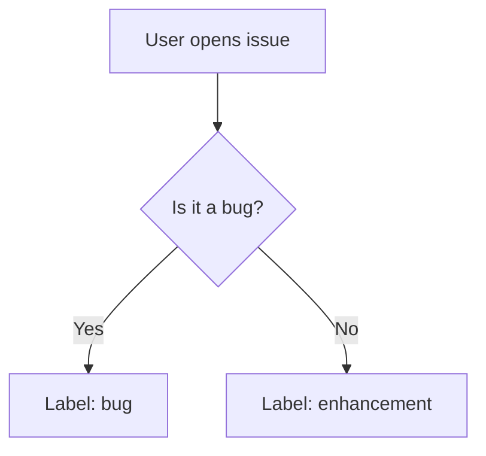

# Appendix U: Resources
## Everything You Need — Before, During, and After the Workshop

> This is your permanent reference. Every link, tool, guide, and community resource from the two-day workshop in one place. Bookmark this page in your fork so it travels with you.

---

## Table of Contents

1. [The Central Project — Agent Forge](#1-the-central-project--agent-forge)
2. [GitHub Accessibility Guides](#2-github-accessibility-guides)
3. [GitHub Skills Learning Modules](#3-github-skills-learning-modules)
4. [Screen Reader Downloads and Documentation](#4-screen-reader-downloads-and-documentation)
5. [VS Code Resources](#5-vs-code-resources)
6. [GitHub Copilot Resources](#6-github-copilot-resources)
7. [GitHub Agentic Workflows](#7-github-agentic-workflows)
8. [Spec-Driven Development — Spec Kit](#8-spec-driven-development--spec-kit)
9. [GitHub CLI, Desktop, and Copilot CLI](#9-github-cli-desktop-and-copilot-cli)
10. [GitHub Mobile Apps](#10-github-mobile-apps)
11. [GitHub Best Practices and Power Features](#11-github-best-practices-and-power-features)
12. [Finding More Contributions](#12-finding-more-contributions)
13. [Accessibility Standards and References](#13-accessibility-standards-and-references)
14. [GitHub Keyboard Shortcuts](#14-github-keyboard-shortcuts)
15. [Community and Support](#15-community-and-support)
16. [Your Workshop Documentation — Offline Reference](#16-your-workshop-documentation--offline-reference)

---

## 1. The Central Project — Agent Forge

The project you forked, contributed to, and carry home.

| Resource | URL | Notes |
|----------|-----|-------|
| **Agent Forge — Main Repo** | [github.com/accesswatch/agent-forge](https://github.com/accesswatch/agent-forge) | The upstream — your contributions go here |
| Getting Started Guide | [agent-forge/Documentation/GETTING-STARTED.md](https://github.com/accesswatch/agent-forge/blob/main/Documentation/GETTING-STARTED.md) | Your first hour with the agents |
| Full Reference Guide | [agent-forge/Documentation/GUIDE.md](https://github.com/accesswatch/agent-forge/blob/main/Documentation/GUIDE.md) | Complete agent and command reference |
| Setup Guide | [agent-forge/SETUP.md](https://github.com/accesswatch/agent-forge/blob/main/SETUP.md) | Configuration and preferences |
| Contributing Guide | [agent-forge/CONTRIBUTING.md](https://github.com/accesswatch/agent-forge/blob/main/CONTRIBUTING.md) | How to submit improvements |
| Security Policy | [agent-forge/SECURITY.md](https://github.com/accesswatch/agent-forge/blob/main/SECURITY.md) | Responsible disclosure instructions |
| MIT License | [agent-forge/LICENSE](https://github.com/accesswatch/agent-forge/blob/main/LICENSE) | Fork it, use it, make it yours |

### Your Personal Fork

After the workshop, your fork lives at:
```
https://github.com/[your-username]/agent-forge
```

**Quick access from VS Code:**
1. Clone your fork: `git clone https://github.com/[your-username]/agent-forge.git`
2. Open in VS Code: `cd agent-forge && code .`
3. Open Copilot Chat: `Ctrl+Shift+I`
4. Type: `@daily-briefing morning briefing`

### Personalizing Your Fork

1. Copy `preferences.example.md` to `preferences.md` in `.github/agents/`
2. Add your GitHub username, your most-used repositories, and your preferred output format
3. Commit the file — now the agents know who you are and what you work on

---

## 2. GitHub Accessibility Guides

Official guides from the GitHub Accessibility team. These were the primary research sources for this workshop's documentation.

| Guide | URL | When to Use |
|-------|-----|-------------|
| **GitHub Repos — Screen Reader Guide** | [accessibility.github.com/documentation/guide/repos](https://accessibility.github.com/documentation/guide/repos/) | Navigating repositories, file trees, branches |
| **GitHub Issues — Screen Reader Guide** | [accessibility.github.com/documentation/guide/issues](https://accessibility.github.com/documentation/guide/issues/) | Filing, reading, commenting on issues |
| **GitHub Pull Requests — Screen Reader Guide** | [accessibility.github.com/documentation/guide/pull-requests](https://accessibility.github.com/documentation/guide/pull-requests/) | Reading diffs, reviewing, merging |
| **GitHub Copilot in VS Code — Screen Reader Guide** | [accessibility.github.com/documentation/guide/github-copilot-vsc](https://accessibility.github.com/documentation/guide/github-copilot-vsc/) | Using Copilot with NVDA, JAWS, VoiceOver |
| **Custom Instructions — Screen Reader Guide** | [accessibility.github.com/documentation/guide/custom-instructions](https://accessibility.github.com/documentation/guide/custom-instructions/) | Configuring Copilot's behavior for your workflow |
| **Getting Started with Custom Agents for Accessibility** | [accessibility.github.com/documentation/guide/getting-started-with-agents](https://accessibility.github.com/documentation/guide/getting-started-with-agents/) | What agents are, custom agents vs custom instructions, informational vs task-oriented agents, step-by-step walkthroughs for building both types |
| Accessibility Settings Overview | [docs.github.com/en/get-started/accessibility](https://docs.github.com/en/get-started/accessibility) | Hovercard settings, motion reduction, color modes |

---

## 3. GitHub Skills Learning Modules

GitHub Skills is GitHub's free, self-paced interactive learning platform. Every course runs **entirely inside GitHub** — no external site, no separate login, no video to watch. Each course uses the **template-copy pattern**: you copy the course repository to your account, and Mona (GitHub's official education bot) activates and teaches you entirely through issues and pull requests.

### How GitHub Skills Works

Unlike a conventional course where you watch videos or read slides, GitHub Skills teaches through doing:

1. **Copy the course:** Select "Start course" → "Use this template" → "Create a new repository." This copies the course scaffold to your own account.
2. **Mona activates:** A GitHub Actions workflow automatically runs — within 20 seconds, Mona opens your first lesson as an Issue in your new repository.
3. **Read and act:** The issue contains step-by-step instructions. You do the task (commit a file, open a PR, resolve a conflict) in the **same repository**.
4. **Mona validates:** Another GitHub Actions workflow detects what you did, checks if it's correct, and either advances you to the next step or gives you feedback to try again.
5. **Repeat until done:** All feedback arrives as issue comments and new issues. The course is complete when Mona closes the final issue with a success message.

### Screen Reader Navigation of a GitHub Skills Course

Since everything happens in GitHub, the accessibility skills from this workshop apply directly:

```
Starting a course:
  Navigate to the module URL
  B → "Start course" button → Enter
  B → "Use this template" → Enter
  B → "Create a new repository" → Enter
  Fill in repo name → Tab → "Create repository" → Enter

Following lessons:
  Navigate to your new repo's Issues tab (G then I)
  H or 3 → find "Step 1:" issue heading → Enter to open it
  Read instructions with ↓ in Browse Mode
  Complete the task described → commit / PR / edit as instructed
  Wait ~20 seconds → Mona posts a follow-up comment or opens the next issue
  9 (NVDA/JAWS) → navigate to comments to read Mona's feedback
```

### After This Workshop — Your Learning Path

GitHub Skills courses are available 24/7 and are completely free. Recommended order after this workshop:

| Module | URL | Duration | Prerequisite | What You Learn |
|--------|-----|----------|-------------|----------------|
| **Introduction to GitHub** | [github.com/skills/introduction-to-github](https://github.com/skills/introduction-to-github) | < 1 hour | None | Branches, commits, pull requests, merge |
| **Communicate Using Markdown** | [github.com/skills/communicate-using-markdown](https://github.com/skills/communicate-using-markdown) | < 1 hour | Introduction to GitHub | Headings, emphasis, images, code blocks, task lists, tables |
| **Review Pull Requests** | [github.com/skills/review-pull-requests](https://github.com/skills/review-pull-requests) | < 30 min | Introduction to GitHub | Assign reviewers, leave comments, suggest changes, apply suggestions, approve, merge |
| **Resolve Merge Conflicts** | [github.com/skills/resolve-merge-conflicts](https://github.com/skills/resolve-merge-conflicts) | < 30 min | Introduction to GitHub | Why conflicts happen, reading conflict markers, resolving in the web editor |
| **Hello GitHub Actions** | [github.com/skills/hello-github-actions](https://github.com/skills/hello-github-actions) | < 30 min | Introduction to GitHub | Workflow files, triggers, jobs, run steps, merge |
| **Write JavaScript Actions** | [github.com/skills/write-javascript-actions](https://github.com/skills/write-javascript-actions) | < 1 hour | Hello GitHub Actions | Custom action metadata (action.yml), writing steps, composing workflows |

**Relationship to this workshop:** The introduction and PR courses reinforce everything you practiced here. The GitHub Actions course is the foundation for understanding the CI/CD workflows that run inside agent-forge.

---

## 4. Screen Reader Downloads and Documentation

### NVDA (Windows)

| Resource | URL |
|----------|-----|
| Download NVDA (free) | [nvaccess.org/download](https://www.nvaccess.org/download/) |
| NVDA User Guide | [nvaccess.org/files/nvda/documentation/userGuide.html](https://www.nvaccess.org/files/nvda/documentation/userGuide.html) |
| NVDA Add-ons | [nvda-project.org/addonStore](https://nvda-project.org/addonStore/) |
| NVDA Community | [nvda-community.github.io](https://nvda-community.github.io) |

**Key commands (quick reference):**
- Toggle browse/focus mode: `NVDA+Space`
- Elements list: `NVDA+F7`
- Next heading: `H` | Next link: `K` | Next button: `B` | Next form field: `F`

### JAWS (Windows)

| Resource | URL |
|----------|-----|
| Download JAWS (trial available) | [freedomscientific.com/products/software/jaws](https://www.freedomscientific.com/products/software/jaws/) |
| JAWS Getting Started | [freedomscientific.com/training/jaws/getting-started](https://www.freedomscientific.com/training/jaws/getting-started/) |
| JAWS Keyboard Reference | [freedomscientific.com/training/jaws/keyboard-shortcuts](https://www.freedomscientific.com/training/jaws/) |

**Key commands (quick reference):**
- Virtual PC Cursor on/off: `Insert+Z`
- Elements list: `Insert+F3`
- Next heading: `H` | Next link: `Tab` or `U` | Next button: `B`

### VoiceOver (macOS / iOS — built in)

| Resource | URL |
|----------|-----|
| VoiceOver User Guide (macOS) | [support.apple.com/guide/voiceover/welcome/mac](https://support.apple.com/guide/voiceover/welcome/mac) |
| VoiceOver Getting Started (macOS) | [apple.com/accessibility/mac/vision](https://www.apple.com/accessibility/mac/vision/) |
| Enable VoiceOver | `Cmd+F5` (macOS) or Settings → Accessibility → VoiceOver (iOS) |

**Key commands (quick reference):**
- Start/stop VoiceOver: `Cmd+F5`
- VO modifier: `Caps Lock` or `Ctrl+Option`
- Rotor: `VO+U`
- Next heading: `VO+Cmd+H`

### Other Screen Readers (Reference)

| Screen Reader | Platform | URL |
|--------------|----------|-----|
| Narrator | Windows (built in) | `Win+Ctrl+Enter` to launch — no download required |
| Orca | Linux (GNOME) | [wiki.gnome.org/Projects/Orca](https://wiki.gnome.org/Projects/Orca) |
| TalkBack | Android (built in) | Settings → Accessibility → TalkBack |

---

## 5. VS Code Resources

| Resource | URL | Notes |
|----------|-----|-------|
| Download VS Code | [code.visualstudio.com](https://code.visualstudio.com) | Free — Windows, macOS, Linux |
| VS Code Accessibility Docs | [code.visualstudio.com/docs/editor/accessibility](https://code.visualstudio.com/docs/editor/accessibility) | Screen reader mode, audio cues, accessible view |
| VS Code Keyboard Shortcuts (Windows) | [aka.ms/vscode-keyboard-windows](https://aka.ms/vscode-keyboard-windows) | Full reference PDF |
| VS Code Keyboard Shortcuts (macOS) | [aka.ms/vscode-keyboard-mac](https://aka.ms/vscode-keyboard-mac) | Full reference PDF |
| GitHub Pull Requests Extension | [marketplace.visualstudio.com/items?itemName=GitHub.vscode-pull-request-github](https://marketplace.visualstudio.com/items?itemName=GitHub.vscode-pull-request-github) | Review and manage PRs from VS Code |
| GitLens | [marketplace.visualstudio.com/items?itemName=eamodio.gitlens](https://marketplace.visualstudio.com/items?itemName=eamodio.gitlens) | Enhanced git history, blame, and branch visualization |
| YAML Support | [marketplace.visualstudio.com/items?itemName=redhat.vscode-yaml](https://marketplace.visualstudio.com/items?itemName=redhat.vscode-yaml) | YAML validation — useful for issue templates |

**Install the GitHub PR extension quickly:**
1. Open VS Code Extensions (`Ctrl+Shift+X`)
2. Search: `GitHub Pull Requests`
3. Install: publisher is "GitHub"

---

## 6. GitHub Copilot Resources

| Resource | URL | Notes |
|----------|-----|-------|
| GitHub Copilot (Free tier) | [github.com/features/copilot](https://github.com/features/copilot) | Free for individuals — no credit card required |
| Copilot Documentation | [docs.github.com/copilot](https://docs.github.com/en/copilot) | Full reference |
| Copilot in VS Code | [docs.github.com/en/copilot/using-github-copilot/getting-started-with-github-copilot](https://docs.github.com/en/copilot/using-github-copilot/getting-started-with-github-copilot) | Setup guide |
| Copilot Extensions Marketplace | [github.com/marketplace?type=apps&copilot_app=true](https://github.com/marketplace?type=apps&copilot_app=true) | Extensions that add capabilities to Copilot Chat |
| Custom Instructions for Copilot | [docs.github.com/en/copilot/customizing-copilot/adding-custom-instructions-for-github-copilot](https://docs.github.com/en/copilot/customizing-copilot/adding-custom-instructions-for-github-copilot) | Teach Copilot your preferences and project context |
| Copilot Coding Agent — Customize Environment | [docs.github.com/en/copilot/how-tos/use-copilot-agents/coding-agent/customize-the-agent-environment](https://docs.github.com/en/copilot/how-tos/use-copilot-agents/coding-agent/customize-the-agent-environment#switching-copilot-to-a-windows-development-environment) | Switch coding agent to Windows dev environment |
| Copilot in VS Code — A11y Guide | [accessibility.github.com/documentation/guide/github-copilot-vsc](https://accessibility.github.com/documentation/guide/github-copilot-vsc/) | Screen reader-optimized usage |

---

## 7. GitHub Agentic Workflows

GitHub Agentic Workflows are in **technical preview** as of February 2026. Access, feedback channels, and setup information:

| Resource | URL | Notes |
|----------|-----|-------|
| Agentic Workflows Blog Post | [github.blog/ai-and-ml/automate-repository-tasks-with-github-agentic-workflows](https://github.blog/ai-and-ml/automate-repository-tasks-with-github-agentic-workflows/) | The announcement — explains the full model |
| `gh-aw` CLI Extension | `gh extension install github/gh-aw` | Install via GitHub CLI |
| Technical Preview Feedback | [gh.io/aw-tp-community-feedback](https://gh.io/aw-tp-community-feedback) | Community discussion for the preview |
| GitHub Next Discord | [gh.io/next-discord](https://gh.io/next-discord) | Real-time discussion with the GitHub Next team |

**How Agentic Workflows connect to what you learned:**

During the workshop, you learned:
1. Standard GitHub Actions (YAML workflows — triggers, jobs, steps)
2. Agent Forge agents (`.agent.md` files — plain English instructions, Copilot Chat executor)
3. GitHub Agentic Workflows (`.md` files in `.github/workflows/` — plain English instructions, cloud-based coding agent executor)

All three live in `.github/`. All three are plain text. The only difference is where they run and how sophisticated their executor is.

---

## 8. Spec-Driven Development — Spec Kit

| Resource | URL | Notes |
|----------|-----|-------|
| Spec Kit — GitHub Repo | [github.com/github/spec-kit](https://github.com/github/spec-kit) | Open source, MIT license |
| Spec Kit Blog Post | [github.blog/ai-and-ml/generative-ai/spec-driven-development-with-ai-get-started-with-a-new-open-source-toolkit](https://github.blog/ai-and-ml/generative-ai/spec-driven-development-with-ai-get-started-with-a-new-open-source-toolkit/) | Full explanation of the methodology |

**The core idea:** Write the intent of a feature before anyone builds it. The specification is a living document — AI uses it to plan tasks, contributors use it to stay aligned, the community uses it to evaluate whether the outcome matched the intention.

**Quick start:**
```bash
uvx --from git+https://github.com/github/spec-kit.git specify init YOUR_PROJECT_NAME
```

**Slash commands:**
- `/specify` — open a new specification session
- `/plan` — convert a spec into a development plan
- `/tasks` — break the plan into trackable tasks

Works with GitHub Copilot, Claude Code, and Gemini CLI.

---

## 9. GitHub CLI, Desktop, and Copilot CLI

### GitHub CLI (`gh`)

| Resource | URL |
|----------|-----|
| Download | [cli.github.com](https://cli.github.com) |
| Documentation | [cli.github.com/manual](https://cli.github.com/manual/) |
| Authentication guide | [docs.github.com/en/github-cli/github-cli/quickstart](https://docs.github.com/en/github-cli/github-cli/quickstart) |

```bash
# Install
winget install GitHub.cli     # Windows
brew install gh               # macOS

# Most useful commands for contributors
gh issue list                 # List issues in current repo
gh issue view 42              # Read issue #42
gh pr list                    # List open PRs
gh pr view 14                 # Read PR #14
gh pr create                  # Create a PR interactively
gh pr merge 14                # Merge PR #14
gh repo fork                  # Fork the current repo
gh repo clone owner/repo      # Clone a repository
```

### Copilot in the CLI (`gh copilot`)

```bash
# Install the extension
gh extension install github/gh-copilot

# Ask Copilot to explain a command
gh copilot explain "git rebase -i HEAD~3"

# Ask Copilot to suggest a command
gh copilot suggest "undo my last commit but keep the changes staged"
```

### GitHub Desktop

| Resource | URL |
|----------|-----|
| Download | [desktop.github.com](https://desktop.github.com) |
| Keyboard shortcuts | [docs.github.com/en/desktop/installing-and-authenticating-to-github-desktop/keyboard-shortcuts-in-github-desktop](https://docs.github.com/en/desktop/installing-and-authenticating-to-github-desktop/keyboard-shortcuts-in-github-desktop) |

---

## 10. GitHub Mobile Apps

GitHub's official mobile apps bring the full GitHub experience to your phone or tablet. Perfect for reviewing PRs, triaging issues, and staying connected when away from your computer.

| Platform | Download | Screen Reader Support |
|----------|----------|----------------------|
| **iOS** | [apps.apple.com/app/github/id1477376905](https://apps.apple.com/app/github/id1477376905) | VoiceOver supported |
| **Android** | [play.google.com/store/apps/details?id=com.github.android](https://play.google.com/store/apps/details?id=com.github.android) | TalkBack supported |

### What You Can Do in GitHub Mobile

- **Browse repositories** — navigate code, read files, view commits
- **Manage issues** — create, edit, comment, close, and label issues
- **Review pull requests** — read diffs, leave comments, request changes, approve, merge
- **Manage notifications** — triage your inbox on the go
- **Interact with GitHub Copilot** — chat with Copilot Chat on mobile (as of Feb 2026)
- **View GitHub Actions** — monitor workflows and check build status
- **Manage Discussions** — participate in community conversations

### Accessibility Features

Both apps support:
- Native screen reader gestures (VoiceOver on iOS, TalkBack on Android)
- Dynamic text sizing
- Dark mode / high contrast
- Keyboard navigation (when using external keyboard with tablet)

**Pro tip:** Enable push notifications for mentions and reviews so you can respond quickly when your input is needed.

---

## 11. GitHub Best Practices and Power Features

Essential tips and lesser-known features that make you a more effective contributor.

### Saved Replies

Saved replies let you create reusable text templates for common responses. Perfect for:
- Thanking first-time contributors
- Requesting more information with a friendly tone
- Explaining common setup issues
- Closing duplicate issues

**How to set up:**
1. Go to [github.com/settings/replies](https://github.com/settings/replies)
2. Click "Add a saved reply"
3. Give it a short label (e.g., "welcome-first-time")
4. Write your template text (can include Markdown)
5. Save

**How to use:**
- When writing any comment, press `Ctrl+.` (period) to open the saved replies menu
- Select your saved reply
- Edit as needed before posting

### Pinned Issues

Pin important issues to the top of your repository's Issues tab. Perfect for:
- FAQs and getting started guides
- Known issues and workarounds
- Roadmap and project status updates
- Community guidelines

**How to pin an issue:**
1. Open the issue you want to pin
2. In the right sidebar, click the three-dot menu (⋯)
3. Select "Pin issue"
4. It now appears at the top of the Issues list

You can pin up to 3 issues per repository. Pinned issues are visible to everyone, even those who haven't starred or watched your repo.

### Pinned Comments (New: Feb 2026)

You can now pin a single comment within an issue thread to keep important information visible. Perfect for:
- Workarounds or temporary solutions
- Decisions made during discussion
- Links to related issues or PRs
- Status updates from maintainers

**How to pin a comment:**
1. Find the comment you want to pin
2. Click the three-dot menu (⋯) on the comment
3. Select "Pin comment"

Only repository collaborators can pin comments. There can be only one pinned comment per issue.

### Linking to Specific Lines of Code

Share precise references to code by including line numbers in GitHub URLs.

**Syntax:**
- Single line: `github.com/owner/repo/blob/main/file.js#L42`
- Line range: `github.com/owner/repo/blob/main/file.js#L42-L58`

**How to create these links:**
1. Navigate to a file on GitHub
2. Click the line number (in screen readers: navigate to the line and activate the number link)
3. Hold `Shift` and click another line number to select a range
4. Copy the URL from your browser — the line numbers are automatically included

**Screen reader tip:** Line numbers are links announced as "Line 42 link" (or similar). They're in the left margin of the code view.

### Permalinks — Stable Links That Never Break

When you link to code on GitHub using a branch name (`main`, `develop`), that link can break if the code changes or the file moves. **Permalinks** use the commit SHA instead of the branch name, creating a permanent snapshot link.

**Why this matters:** When you file a bug report or reference code in a discussion, you want the link to show exactly what you were looking at — not what the code looks like weeks later after someone refactored it.

**How to create a permalink:**
1. View any file on GitHub
2. Press `Y` while viewing the file — the URL changes from `/blob/main/file.js` to `/blob/a1b2c3d4.../file.js`
3. Copy the new URL — it now points to that specific commit

**Shortcut:** `Y` = "Yank permalink" (borrows from Vim terminology)

### Converting Issues to Discussions

Not every issue is a bug or feature request. Some are questions, proposals, or open-ended conversations. GitHub Discussions provide a better home for these.

**When to convert:**
- Questions that don't require a code change ("How do I configure X?")
- Proposals that need community feedback before becoming actionable
- General discussion about the project's direction
- Show-and-tell or community showcases

**How to convert an issue to a discussion:**
1. Open the issue
2. In the right sidebar, click "Convert to discussion"
3. Select which discussion category it belongs in
4. Confirm

All comments and history are preserved. The issue is closed and replaced with a link to the new discussion.

### Team Mentions — Notify a Whole Group

In organizations, you can mention entire teams instead of individuals: `@org-name/team-name`

**Example:** `@github/accessibility` notifies everyone on GitHub's accessibility team.

**Why this matters:**
- You don't need to know who's on a team — just mention the team
- Teams can subscribe to notifications as a group
- CODEOWNERS files use team mentions for automatic reviewer assignment

**Permission:** You can only mention teams you have visibility to. Public teams in public orgs can be mentioned by anyone.

### Collapsible Sections in Markdown

Keep long issue descriptions or PR descriptions scannable by hiding details in collapsible sections.

**Syntax:**
```markdown
<details>
<summary>Click to expand: Full error stack trace</summary>

(Your detailed content here — code blocks, lists, anything)

</details>
```

**Use for:**
- Long error messages or logs
- Optional context that most readers don't need
- Large screenshots or code samples
- Step-by-step troubleshooting instructions

**Accessibility note:** Collapsible sections are announced as "disclosure triangles" or "expandable" regions by most screen readers. The summary text is always visible.

### Co-Authored Commits

Credit multiple people for a single commit using the `Co-authored-by` trailer in your commit message.

**Syntax:**
```
Fix keyboard navigation in modal dialog

This addresses the issue where focus was lost when the modal closed.

Co-authored-by: Alex Chen <alex@example.com>
Co-authored-by: Jordan Smith <jordan@example.com>
```

**Why this matters:**
- Pair programming — both people get credit in the Git history
- Crediting someone who provided the solution but didn't write the code
- GitHub recognizes these trailers and shows all co-authors on the commit

**Screen reader tip:** When viewing a commit with co-authors on GitHub, screen readers announce "Co-authored-by" in the commit details.

### Understanding Watch, Star, and Fork

Three ways to interact with a repository — each means something different:

| Action | What It Does | When to Use |
|--------|--------------|-------------|
| **Watch** | Subscribe to notifications for activity | You want to stay updated on issues, PRs, and releases |
| **Star** | Bookmark a repo | You want to save it for later or show appreciation |
| **Fork** | Create your own copy of the repo | You want to contribute changes or use it as a starting point |

**Watch settings:**
- **All activity** — every issue, PR, and discussion
- **Participating** (default) — only threads you comment on or are @mentioned in
- **Releases only** — just new releases
- **Ignore** — unsubscribe completely

**Pro tip:** Star repos for discovery; Watch repos you actively contribute to.

### CODEOWNERS — Automatic Reviewer Assignment

The `CODEOWNERS` file automatically requests reviews from specific people or teams when files in their area are changed.

**Location:** `.github/CODEOWNERS` in your repository

**Syntax:**
```
# Documentation team reviews all docs changes
/docs/ @org-name/docs-team

# Accessibility specialist reviews UI changes
/src/components/ @username

# Security team reviews authentication code
/src/auth/ @org-name/security-team

# Default owner for everything else
* @project-lead
```

**How it works:**
1. Someone opens a PR that changes files in `/docs/`
2. GitHub automatically requests a review from `@org-name/docs-team`
3. The PR can't be merged until the required review is approved (if branch protection requires it)

**Use for:**
- Ensuring domain experts review specialized code
- Distributing review responsibilities
- Preventing changes from being merged without appropriate oversight

### GitHub Sponsors

Support open source maintainers financially through GitHub Sponsors. If a project you use has a "Sponsor" button, consider supporting them.

**How it works:**
- Maintainers set up a Sponsors profile
- You can sponsor with a monthly recurring amount or one-time payment
- GitHub doesn't take a fee (as of 2026)

**Why sponsor:**
- Open source maintainers often work for free in their spare time
- Your sponsorship helps them dedicate more time to the project
- Many maintainers offer perks to sponsors (early access, prioritized issues, etc.)

**How to sponsor:**
1. Visit a repository with a "Sponsor" button
2. Click the button
3. Choose a sponsorship tier
4. Complete payment through GitHub Sponsors

### Advanced Markdown Features

GitHub supports several powerful Markdown features beyond the basics:

**Task Lists:**
```markdown
- [x] Completed task
- [ ] Pending task
- [ ] Another pending task
```

**Tables with alignment:**
```markdown
| Left-aligned | Center-aligned | Right-aligned |
|:-------------|:--------------:|--------------:|
| Text         | Text           | Text          |
```

**Mermaid Diagrams:**
````markdown

````

**Math Expressions (LaTeX):**
```markdown
Inline math: $E = mc^2$

Block math:
$$
\sum_{i=1}^{n} i = \frac{n(n+1)}{2}
$$
```

**Footnotes:**
```markdown
Here is a statement that needs citation[^1].

[^1]: Source: Documentation link
```

**Alerts (Callout blocks):**
```markdown
> [!NOTE]
> Useful information that users should know

> [!WARNING]
> Critical content requiring immediate attention

> [!TIP]
> Helpful advice for better outcomes
```

---

## 12. Finding More Contributions

After the workshop, use these resources to find your next open source contribution.

| Resource | URL | What It Does |
|----------|-----|-------------|
| **Good First Issue** | [goodfirstissue.dev](https://goodfirstissue.dev) | Curated list of beginner-friendly issues across popular open source projects |
| **Up For Grabs** | [up-for-grabs.net](https://up-for-grabs.net) | Projects that explicitly welcome new contributors |
| **GitHub Explore** | [github.com/explore](https://github.com/explore) | Discover trending repos, topics, and collections |
| **Accessibility on GitHub** | Search: `topic:accessibility is:public` | Public repositories tagged with the accessibility topic |
| **AT on GitHub** | Search: `topic:assistive-technology is:public` | Public repositories tagged with assistive-technology |
| **Filter by label** | In any repo: Issues → Label → `good first issue` | Works on every public repository |

**GitHub search queries to bookmark:**

```
is:open is:issue label:good-first-issue topic:accessibility
is:open is:issue label:help-wanted topic:screen-reader
is:open is:issue label:accessibility no:assignee
```

---

## 13. Accessibility Standards and References

| Resource | URL | Notes |
|----------|-----|-------|
| WCAG 2.2 (Full Standard) | [w3.org/TR/WCAG22](https://www.w3.org/TR/WCAG22/) | The complete Web Content Accessibility Guidelines |
| WCAG Quick Reference | [w3.org/WAI/WCAG22/quickref](https://www.w3.org/WAI/WCAG22/quickref/) | Filtered, searchable version — much more practical |
| ARIA Authoring Practices Guide | [w3.org/WAI/ARIA/apg](https://www.w3.org/WAI/ARIA/apg/) | When and how to use ARIA roles and attributes |
| WebAIM Screen Reader Survey | [webaim.org/projects/screenreadersurvey](https://webaim.org/projects/screenreadersurvey/) | Real-world data on how screen reader users work |
| The A11y Project | [a11yproject.com](https://www.a11yproject.com) | Community-driven accessibility checklist and resources |
| Deque University (free content) | [dequeuniversity.com](https://www.dequeuniversity.com) | Free accessibility rules reference |
| MDN Accessibility Guide | [developer.mozilla.org/en-US/docs/Web/Accessibility](https://developer.mozilla.org/en-US/docs/Web/Accessibility) | Web accessibility fundamentals |

### Accessibility Testing Tools

| Tool | URL | Notes |
|------|-----|-------|
| WebAIM Contrast Checker | [webaim.org/resources/contrastchecker](https://webaim.org/resources/contrastchecker/) | Check text/background color contrast against WCAG AA/AAA |
| WAVE Browser Extension | [wave.webaim.org/extension](https://wave.webaim.org/extension/) | Highlights accessibility issues on any webpage — Chrome, Firefox, Edge |
| Axe DevTools | [deque.com/axe/devtools](https://www.deque.com/axe/devtools/) | Finds WCAG violations with severity levels |
| Lighthouse | In Chrome DevTools (F12 → Lighthouse tab) | Built-in auditing for accessibility, performance, and SEO |

### Interactive Git Learning

| Resource | URL | Notes |
|----------|-----|-------|
| Learn Git Branching | [learngitbranching.js.org](https://learngitbranching.js.org/) | Gamified, step-by-step challenges — branching, merging, rebasing |
| Visualizing Git | [git-school.github.io/visualizing-git](https://git-school.github.io/visualizing-git/) | Interactive visual playground for branches and commits |
| Pro Git Book (free) | [git-scm.com/book/en/v2](https://git-scm.com/book/en/v2) | Complete reference — free online |
| Git Cheat Sheet | [github.github.com/training-kit/downloads/github-git-cheat-sheet.pdf](https://github.github.com/training-kit/downloads/github-git-cheat-sheet.pdf) | Quick command reference PDF |

---

## 14. GitHub Keyboard Shortcuts

| Resource | URL | Notes |
|----------|-----|-------|
| Full Keyboard Shortcuts Reference | [docs.github.com/en/get-started/accessibility/keyboard-shortcuts](https://docs.github.com/en/get-started/accessibility/keyboard-shortcuts) | Every shortcut on every page |
| Press `?` on any GitHub page | — | Opens the keyboard shortcuts overlay for that specific page |

**The most important shortcuts to memorize:**

| Shortcut | What It Does |
|----------|-------------|
| `?` | Open keyboard shortcuts help for current page |
| `G I` (press G then I) | Go to Issues tab |
| `G P` | Go to Pull Requests tab |
| `G A` | Go to Actions tab |
| `G C` | Go to Code tab |
| `/` | Focus the search bar |
| `C` | Create a new issue (on Issues list page) |
| `E` | Archive notification (on Notifications page) |
| `Shift+I` | Mark notification as read |
| `M` | Mute thread (on Notifications page) |

---

## 14b. Learning Pathways

Not sure where to start after the workshop? Use these suggested paths.

### By Role

| Role | Start Here | Then |
|------|-----------|------|
| New contributor | `00-pre-workshop-setup.md` | Issues → Pull Requests → Merge Conflicts |
| Maintainer | `08-labels-milestones-projects.md` | Issue templates → Branch protection → Notifications |
| Accessibility advocate | `14-accessible-code-review.md` | Screen reader cheat sheet → Appendix C (Standards) |
| Facilitator | `FACILITATOR.md` | Day 1 and Day 2 agendas → FAQ |

### By Time Available

| Time | Suggested Path |
|------|----------------|
| 30 min | Pre-workshop setup → Understanding GitHub's web structure |
| 1 hour | Add: Working with Issues |
| 2 hours | Add: Pull Requests + Navigating Repositories |
| 4+ hours | All core chapters → pick one advanced appendix topic |

---

## 15. Community and Support

### GitHub Accessibility

| Resource | URL |
|----------|-----|
| GitHub Accessibility Community Discussions | [github.com/orgs/community/discussions/categories/accessibility](https://github.com/orgs/community/discussions/categories/accessibility) |
| GitHub Accessibility Feedback | [github.com/github-community/community/discussions/categories/accessibility](https://github.com/github-community/community/discussions/categories/accessibility) |
| GitHub Accessibility Team (public presence) | [accessibility.github.com](https://accessibility.github.com) |

### Agent Forge Community

| Resource | URL |
|----------|-----|
| Agent Forge Issues (bug reports, ideas) | [github.com/accesswatch/agent-forge/issues](https://github.com/accesswatch/agent-forge/issues) |
| Agent Forge Discussions | [github.com/accesswatch/agent-forge/discussions](https://github.com/accesswatch/agent-forge/discussions) |
| Security concerns | jeff@jeffbishop.com (do not open public issues for vulnerabilities) |

### Open Source Accessibility Community

| Resource | URL |
|----------|-----|
| A11y Slack | [web-a11y.slack.com](https://web-a11y.slack.com) (invite: [a11y.me/slack](https://www.a11y.me/slack)) |
| A11y Weekly Newsletter | [a11yweekly.com](https://a11yweekly.com) |
| Inclusive Design Research Centre | [idrc.ocadu.ca](https://idrc.ocadu.ca) |

---

## 16. Your Workshop Documentation — Offline Reference

Every guide from this workshop lives in your fork. Clone your fork once and the complete documentation works offline — no internet required.

```bash
git clone https://github.com/[your-username]/agent-forge.git
```

The documentation set is in the `docs/` folder of this learning repository (separate from the `agent-forge` fork). If your workshop facilitator shared a repository link for the learning materials, clone that too.

### Quick Navigation

| Topic | File |
|-------|------|
| Pre-workshop setup | [docs/00-pre-workshop-setup.md](00-pre-workshop-setup.md) |
| Understanding GitHub's Web Structure | [docs/01-understanding-github-web-structure.md](01-understanding-github-web-structure.md) |
| Navigating repositories | [docs/02-navigating-repositories.md](02-navigating-repositories.md) |
| The Learning Room | [docs/03-the-learning-room.md](03-the-learning-room.md) |
| Working with issues | [docs/04-working-with-issues.md](04-working-with-issues.md) |
| Working with pull requests | [docs/05-working-with-pull-requests.md](05-working-with-pull-requests.md) |
| Merge conflicts | [docs/06-merge-conflicts.md](06-merge-conflicts.md) |
| Culture and etiquette | [docs/07-culture-etiquette.md](07-culture-etiquette.md) |
| Labels, milestones, projects | [docs/08-labels-milestones-projects.md](08-labels-milestones-projects.md) |
| Notifications | [docs/09-notifications.md](09-notifications.md) |
| Day 1 agenda | [DAY1_AGENDA.md](../DAY1_AGENDA.md) |
| Day 2 agenda | [DAY2_AGENDA.md](../DAY2_AGENDA.md) |
| VS Code: Setup & Accessibility Basics | [docs/10-vscode-basics.md](10-vscode-basics.md) |
| VS Code: Git & Source Control | [docs/11-git-source-control.md](11-git-source-control.md) |
| VS Code: GitHub Pull Requests Extension | [docs/12-github-pull-requests-extension.md](12-github-pull-requests-extension.md) |
| VS Code: GitHub Copilot | [docs/13-github-copilot.md](13-github-copilot.md) |
| Accessible Code Review | [docs/14-accessible-code-review.md](14-accessible-code-review.md) |
| Issue Templates | [docs/15-issue-templates.md](15-issue-templates.md) |
| VS Code: Agent Forge | [docs/16-agent-forge.md](16-agent-forge.md) |
| Resources (this file) | [docs/appendix-u-resources.md](appendix-u-resources.md) |
| **Appendix A:** GitHub Concepts Glossary | [docs/appendix-a-glossary.md](appendix-a-glossary.md) |
| **Appendix B:** Screen Reader Cheat Sheet | [docs/appendix-b-screen-reader-cheatsheet.md](appendix-b-screen-reader-cheatsheet.md) |
| **Appendix C:** Accessibility Standards Reference | [docs/appendix-c-accessibility-standards.md](appendix-c-accessibility-standards.md) |
| **Appendix D:** Git Authentication | [docs/appendix-d-git-authentication.md](appendix-d-git-authentication.md) |
| **Appendix E:** GitHub Flavored Markdown | [docs/appendix-e-github-flavored-markdown.md](appendix-e-github-flavored-markdown.md) |
| **Appendix F:** GitHub Gists | [docs/appendix-f-github-gists.md](appendix-f-github-gists.md) |
| **Appendix G:** GitHub Discussions | [docs/appendix-g-github-discussions.md](appendix-g-github-discussions.md) |
| **Appendix H:** Releases, Tags, and Repository Insights | [docs/appendix-h-releases-tags-insights.md](appendix-h-releases-tags-insights.md) |
| **Appendix I:** GitHub Projects Deep Dive | [docs/appendix-i-github-projects.md](appendix-i-github-projects.md) |
| **Appendix J:** GitHub Advanced Search | [docs/appendix-j-advanced-search.md](appendix-j-advanced-search.md) |
| **Appendix K:** Branch Protection Rules and Repository Rulesets | [docs/appendix-k-branch-protection-rulesets.md](appendix-k-branch-protection-rulesets.md) |
| **Appendix L:** GitHub Security Features | [docs/appendix-l-github-security-features.md](appendix-l-github-security-features.md) |
| **Appendix M:** VS Code Accessibility Reference | [docs/appendix-m-vscode-accessibility-reference.md](appendix-m-vscode-accessibility-reference.md) |
| **Appendix N:** GitHub Codespaces | [docs/appendix-n-github-codespaces.md](appendix-n-github-codespaces.md) |
| **Appendix O:** GitHub Mobile | [docs/appendix-o-github-mobile.md](appendix-o-github-mobile.md) |
| **Appendix P:** Publishing with GitHub Pages | [docs/appendix-p-github-pages.md](appendix-p-github-pages.md) |
| **Appendix Q:** GitHub Actions and Workflows | [docs/appendix-q-github-actions-workflows.md](appendix-q-github-actions-workflows.md) |
| **Appendix R:** GitHub Profile, Sponsors, and Wikis | [docs/appendix-r-github-profile-sponsors-wikis.md](appendix-r-github-profile-sponsors-wikis.md) |
| **Appendix S:** Organizations, Templates, and Repository Settings | [docs/appendix-s-github-organizations-templates.md](appendix-s-github-organizations-templates.md) |
| **Appendix T:** Contributing to Open Source | [docs/appendix-t-contributing-to-open-source.md](appendix-t-contributing-to-open-source.md) |
| **Appendix U:** Resources (this file) | [docs/appendix-u-resources.md](appendix-u-resources.md) |
| **Appendix V:** Agent Forge Reference | [docs/appendix-v-agent-forge-reference.md](appendix-v-agent-forge-reference.md) |
| **Appendix W:** GitHub Copilot Reference | [docs/appendix-w-github-copilot-reference.md](appendix-w-github-copilot-reference.md) |
| **Appendix X:** GitHub Copilot AI Models | [docs/appendix-x-copilot-models.md](appendix-x-copilot-models.md) |

---

*Back: [Issue Templates](15-issue-templates.md)*
*Start over: [README ←](../README.md)*
*Reference: [Screen Reader Cheat Sheet](appendix-b-screen-reader-cheatsheet.md)*
